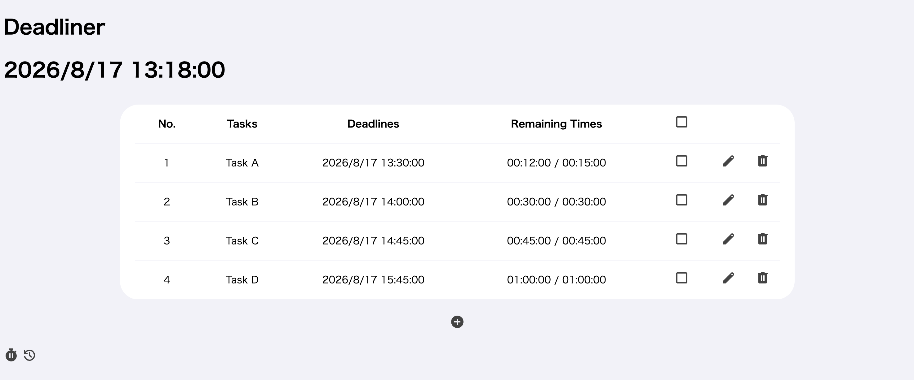
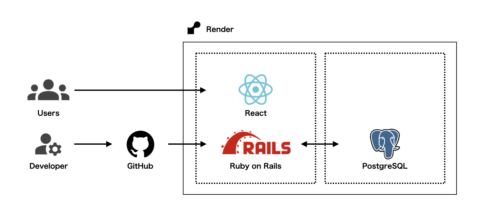
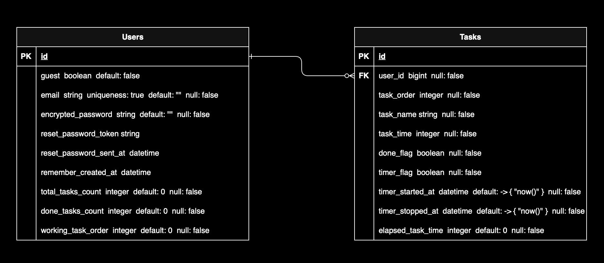

  
  
  
  

# Deadliner
タイマー付きタスク管理アプリ。

## サービス概要
本アプリは、タスク管理能力向上のサポートを目的に作成されました。

(1)ユーザーはタスクを作成することができ、各タスクには完了までの予想時間を設定することができます。\
(2)タスク作成後にタイマーを起動することで、各タスクのDeadline算出と残り時間のカウントダウンが行われます。\
(3)タスク完了までの時間の予実を振り返ることで、タスク管理能力向上にご利用頂けます。

## サービスURL
https://dead-liner.onrender.com

## 使用方法
- タスクの新規作成\
新規作成ボタンをクリックすることで、新規作成画面へ遷移します。\
タスク名とタスク完了までの予想時間を入力することで、タスクを新規作成できます。

- タスクの状態切替（完了/未完了）\
チェックボックスをクリックすることで、タスクの状態を完了/未完了に切替できます。

- タスクの編集\
編集ボタンをクリックすることで、編集画面へ遷移します。\
タスク名またはタスク完了までの予想時間を編集できます。

- タスクの削除\
削除ボタンをクリックすることで、タスクを削除できます。

- タイマー起動/停止/リセット\
タスク作成後、タイマーボタンをクリックすることで各タスクのDeadline算出と残り時間のカウントダウンが行われます。\
再度タイマーボタンをクリックすることでタイマーを一時停止、タイマーリセットボタンをクリックすることでDeadlineと残り時間をリセットできます。

## 使用技術
- React：19.2.7
- Ruby：4.0.5
- Ruby on Rails：8.1.3
- PostgreSQL：18.4
- Render

## 構成図

## ER図

